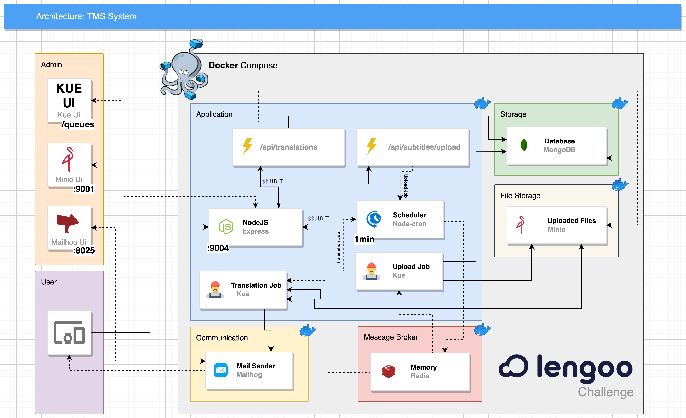

# Lengoo Backend Challenge

## Intro

Challenge proposed by Lengoo on a selection process for a back-end Developer role that consists of developing a back-end application, with the following requirements:

- Create a REST API for uploading subtitles in a plain text format (.txt) and send an email with the translation as attachment once the process done.
- Create the TMS either inside or outside the document translator (however you feel is the best way) with the two endpoints stated before.
- The task must be developed with NodeJS.
- All code as well as documentation or comments must be in English.
- The code must run. You can assume the reviewer has NodeJS and docker on their machine, but no databases or other runtimes.

First of all I would like to thank you for the opportunity to be able to take the test.

## Architecture


## Services Management

AS you can see I'm using Mailhog to send mails, Minio to storage files, and Kue to schedule jobs in a redis. You can access all this interfaces just going trough:

**Minio** - *Visualize files.* - [[Access](http://0.0.0.0:9001), [Print](./images/minio.png)]

**Mailhog** - *Visualize mails with processed translations.* - [[Access](http://0.0.0.0:8025), [Print](./images/mailhog.png)]

**Kue Api** - *Visualize jobs by status.* - [[Access](http://0.0.0.0:9004/queues/api), [Print](./images/kue.queues.png)]

**Kue Queues** - *Visualize jobs by Queues.* - [[Access](http://0.0.0.0:9004/queues), [Print](./images/kue.api.png)]


## Primarily Used Technologies

- [Node](https://nodejs.org/en/) - 14.17.0
- [Yarn](https://yarnpkg.com/) - 1.22.17
- [Jest](https://jestjs.io/) - 27.5.1
- [Dotenv-Safe](https://www.npmjs.com/package/dotenv-safe) - 8.2.0
- [Express](https://expressjs.com/) - 4.17.2
- [Mongoose](https://mongoosejs.com/) - 5.13.7
- [Supertest](https://www.npmjs.com/package/supertest) - 6.2.2
- [Babel](https://babeljs.io/) - 7.17.0
- [Eslint](https://eslint.org/) - 8.9.0
- [Joi](https://joi.dev/) - 17.6.0
- [Kue](https://www.npmjs.com/package/kue) - 0.11.6
- [Minio](https://min.io/)
- [Redis](https://redis.io/)
- [Docker](https://www.docker.com/)
- [Docker Compose](https://docs.docker.com/compose/)
- [Mailhog](https://github.com/mailhog/MailHog)


## Instalation

### Prerequisites

To run on docker you only need to have `docker version 20.10.5` or greather and `docker-compose version 1.29.0` or greather installed, but if you wanna to run locally, will need aditionally to have Node installed in version v12.x.x or v14.x.x.

### Phases

To run the application on your machine, follow these steps:

#### Docker

1. git clone [https://github.com/lengoo/harbs-backend-coding-challenge](https://github.com/lengoo/harbs-backend-coding-challenge)

2. `cd harbs-backend-coding-challenge` to access the project folder.

3. `git checkout development` to go to development branch.

4. `docker-compose up -d --build` it will run all necessary things.

#### Local


1. git clone [https://github.com/lengoo/harbs-backend-coding-challenge](https://github.com/lengoo/harbs-backend-coding-challenge)

2. `cd harbs-backend-coding-challenge` to access the project folder.

3. `yarn` or `npm install` to performs installation of dependencies.

4. `cp .env.example .env` to copy environment variables.

5. `yarn importData` or `npm run importData` for import the default api user.
6. `yarn build` or `npm run build` to build the application.

7. `yarn start` or `npm run start` to run the application.

*PS: `yarn dev` to run on dev mode.*

*PS: If you wanna to run local without docker, go to created `.env` file and change the value for `127.0.0.1` or `0.0.0.0`: from these envs: `MONGO_HOST, REDIS_HOST, MAILHOG_HOST and MINIO_HOST.`*

## CURL to test API


```shell
curl --request GET --url http://0.0.0.0:9004/api
```

## Tests

Code coverage: `82.05%`.

To run the integration and unit tests run the following command: `yarn test`


## Author

[João Harbs](https://github.com/devbarba)
